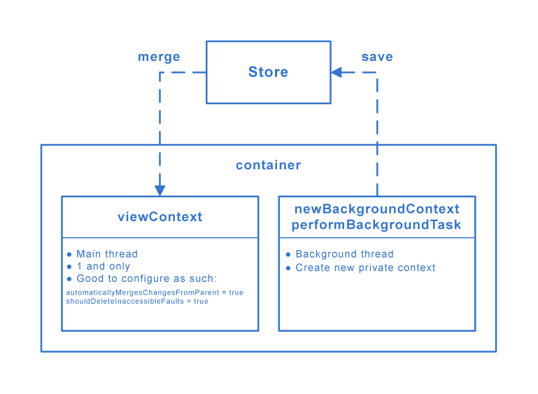

# [Apple CoreData](https://samwize.com/2018/09/01/modern-guide-to-core-data-2018/)
Core Data is an object graph and persistence framework provided by Apple on macOS, iOS, iPadOS, watchOS, and tvOS operating systems. It allows data organized by the relational entity–attribute model to be serialized into XML, binary, or SQLite stores. The data can be manipulated using higher level objects representing entities and their relationships. Core Data manages the serialized version, providing object lifecycle and object graph management, including persistence. Core Data interfaces directly with SQLite, insulating the developer from the underlying SQL.

## Container and contexts

