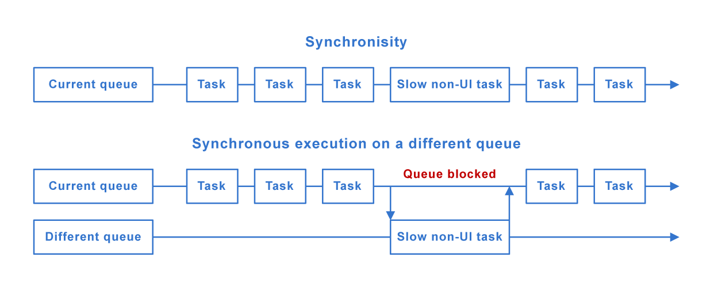
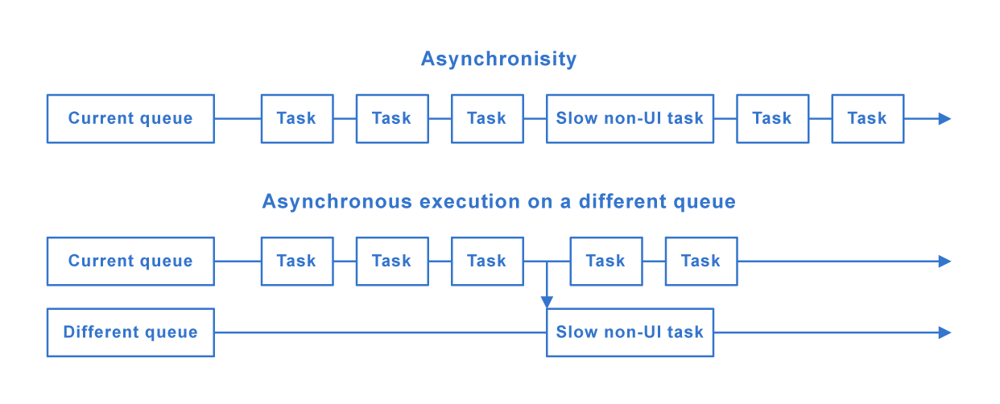
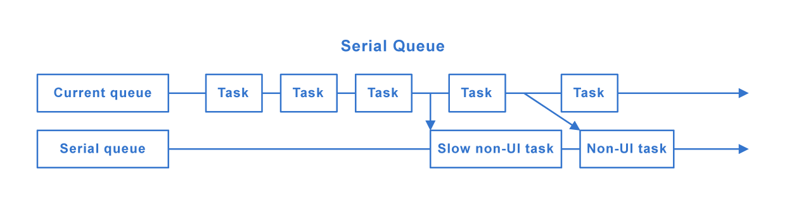
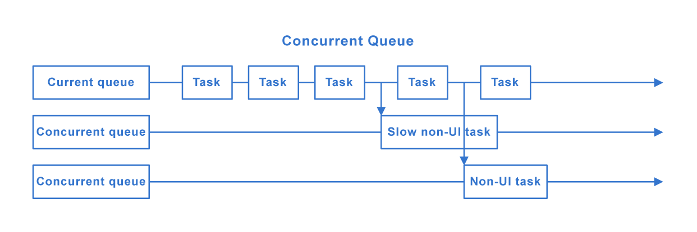
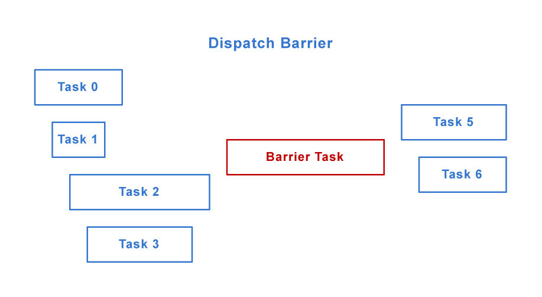

# [GCD](https://medium.com/shakuro/introduction-to-ios-concurrency-a5db1cf18fa6)
**Grand Central Dispatch** (GCD), is a technology developed by Apple Inc. to optimize application support for systems with multi-core processors and other symmetric multiprocessing systems.

GCD provides three main types of queues:
- **main** – main sequential queue.
- **global** – global parallel queue.
- **custom** – custom queue, can be either serial or parallel.

It is important to understand that all of these global queues are **SYSTEM** global queues and our tasks are not the only tasks in this queue.

*High priority:*
- (qos: **.userInteractive**) – fast and at the moment
- (qos: **.userInitiated**) – few seconds
- (qos: **.utility**) – from a few seconds to several minutes

*Default priority:*
- (qos: **.default**) or () – between **.userInitiated** and **.utility**

*Low priority:*
- (qos: **.background**) – from minutes to hours
- (qos: **.unspecified**) – lowest priority

## Synchronous method
- **NEVER** call the **sync** method on a **serial** queue because it will deadlock your application!
- **NEVER** call the **sync** method on the **main** queue because your application will crash!

## Asynchronous method

## Serial queue

## Concurrent queue

## Barrier

