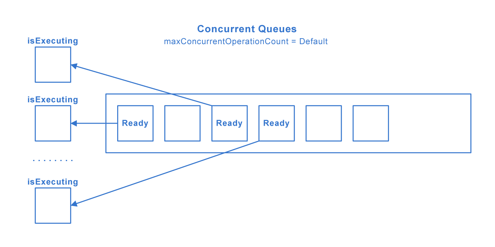
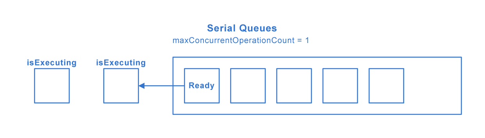
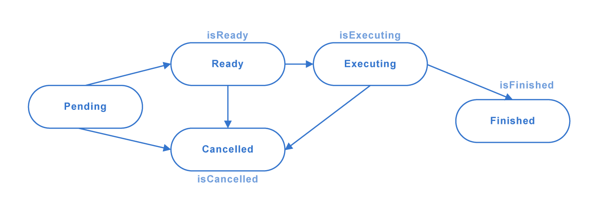
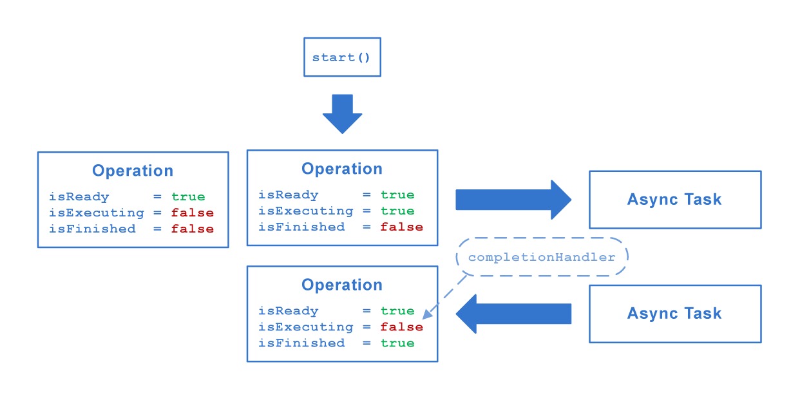
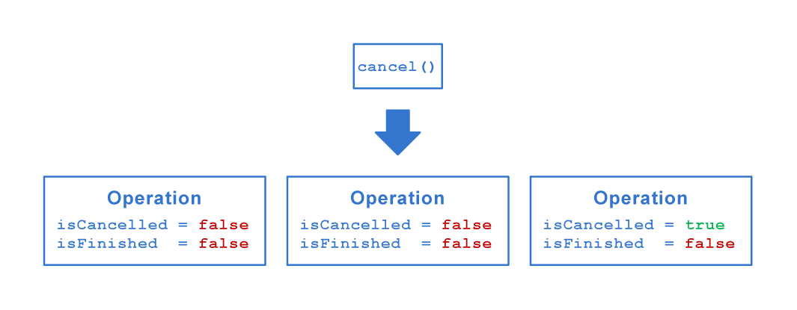
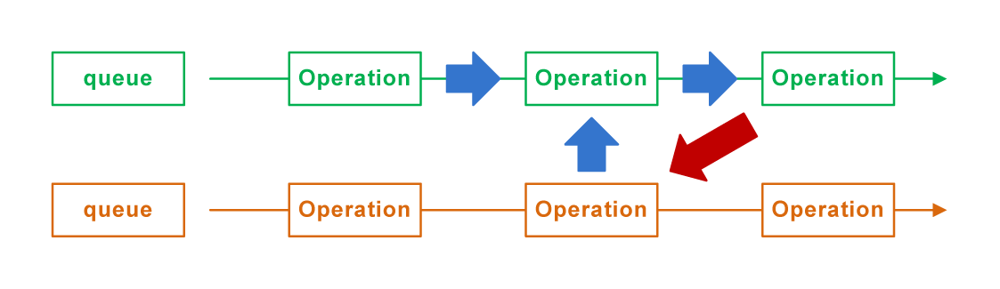

# [Operations](https://www.avanderlee.com/swift/operations/)
**Operations** in Swift are a powerful way to separate responsibilities over several classes while keeping track of progress and dependencies. They’re formally known as **NSOperations** and used in combination with the **OperationQueue**.

- OperationQueue.main – main UI queue.
- OperationQueue.current – current queue.

*Quality of Service:*
- **userInteractive** = 33
- **userInitiated** = 25
- **utility** = 17
- **background** = 9
- **default** = -1

## Concurrenct Queues (Default)

## Serial Queues (Count = 1)

## Life Сycle

## Async Task

## Cancel

## Deadlock Dependencies

